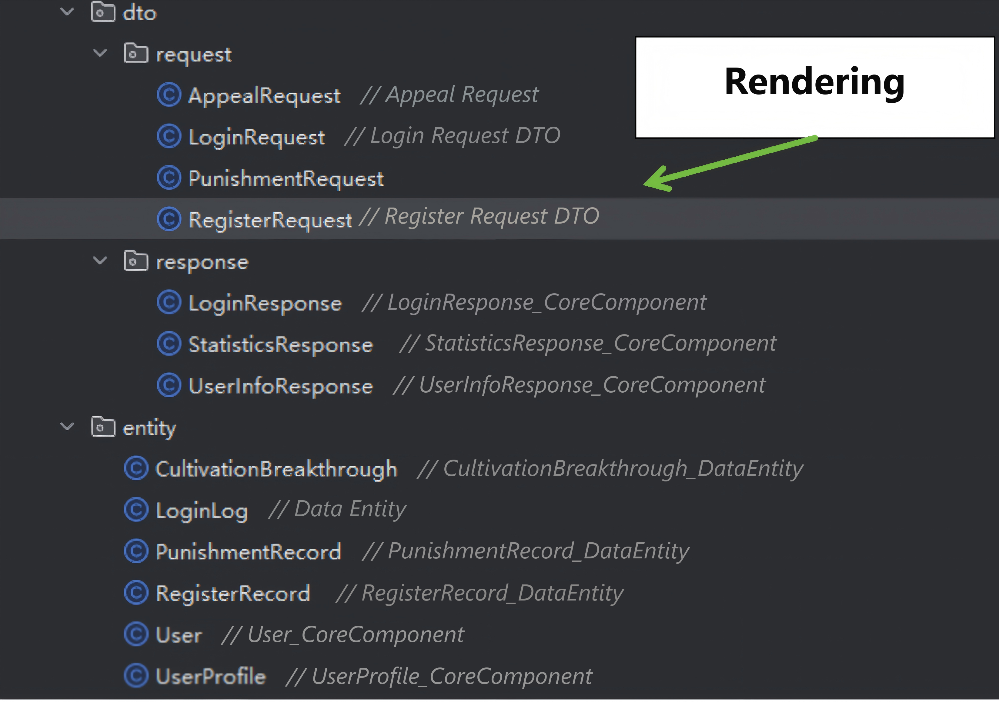
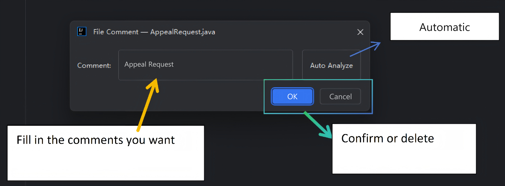
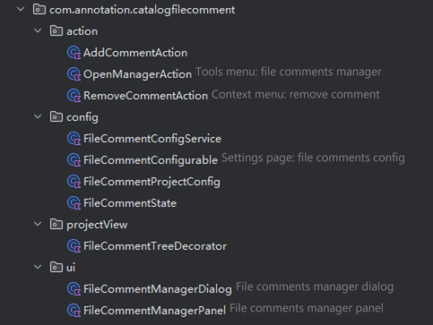
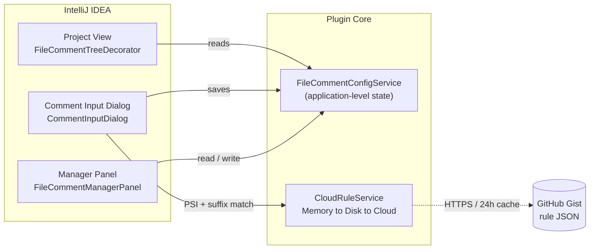

<div align="center">


# Catalog File Comments

**Sticky notes for your code directory — an enterprise-architecture panorama for the IntelliJ Project View.**

[](https://plugins.jetbrains.com/plugin/30144-catalog-file-comments)
[](https://plugins.jetbrains.com/docs/intellij)
[](https://kotlinlang.org)
[](LICENSE)

</div>

---

## ✨ Overview

In large projects, filenames rarely tell the full story. **Catalog File Comments** lets you attach a short annotation to any file and displays it directly after the filename in the Project View — like sticky notes on your directory tree, without touching a single line of source code.

```text
AppealRequest.java         // Appeal Request
LoginRequest.java          // Login Request DTO
PunishmentRequest.java
UserServiceImpl.java       // UserServiceImpl_Business Layer / Service Layer_ServiceImpl
User.java                  // User_CoreComponent
```

Once the comments are filled in, the layered structure of the whole project becomes visible at a glance — what used to require opening dozens of files can now be understood while scrolling the tree.

## 📸 Screenshots

| Visual comments in the Project View | Auto-analyze in the comment dialog |
| :-: | :-: |
|  |  |

| Right-click workflow | The plugin annotating its own source |
| :-: | :-: |
|  |  |

## 🚀 Features

- 🏷️ **Visual comments** — a subtle gray italic annotation (`// comment`) right after the file name, matching the IDE look and feel.
- 🧠 **Smart analysis** — one click on **Auto Analyze** inspects the Java class via PSI (class name, implemented interfaces, fields, modifiers) and matches it against **100+ enterprise-architecture rules** (Controller, ServiceImpl, Repository, Mapper, Entity, …). Unmatched names fall back to structural heuristics.
- ☁️ **Cloud rules + offline cache** — rules live in a public GitHub Gist, are fetched over HTTPS, cached on disk for 24 hours and refreshed automatically; when the network is down the last good cache keeps working.
- 🗂️ **Batch manager** — a table-based manager to search, add, edit and delete comments in bulk, import/export through clipboard JSON, and view statistics.
- 🧹 **Zero footprint** — comments never modify your sources; they are stored in the IDE configuration only.
- 🌐 **Unicode friendly** — comments accept Latin, CJK and common punctuation.

## 🕹️ Usage

| Task | How |
| --- | --- |
| Add / edit a comment | Right-click a file in the Project View → **Add File Comment** |
| Let the plugin suggest one | In the dialog, click **Auto Analyze** |
| Remove a comment | Right-click → **Remove File Comment** (with confirmation) |
| Manage everything at once | **Tools → File Comments Manager**, or **Settings → Tools → File Comments** |

The manager supports inline row editing, keyword search, clipboard import/export (JSON) and a quick comment count.

### How auto-analysis works

1. The class name is read via PSI (Java files); other file types use a name-only match.
2. The name is matched against cloud rules using **longest-suffix-wins** (so `ServiceImpl` beats `Impl`).
3. Without a cloud match, lightweight heuristics are applied in order: `Interface` → `Enum` → `AbstractBase` → `DataEntity` (has `id` + timestamp fields) → `BusinessService` / `DataRepository` / `DataAccess` (by implemented interface) → `CoreComponent`.

> Auto-analysis never reads source comments or Javadoc — only structural information is used.

## 📦 Installation

### JetBrains Marketplace (recommended)

1. **Settings → Plugins → Marketplace**
2. Search for **Catalog File Comments** and click **Install**
3. Restart the IDE

Requires **IntelliJ IDEA 2024.3+** (Community or Ultimate, build 243+). Other IntelliJ Platform IDEs with Java support may work as well.

### From source

```bash
./gradlew buildPlugin
```

The installable ZIP is produced under `build/distributions/`. Install it via **Settings → Plugins → ⚙︎ → Install Plugin from Disk…**.

## 💾 Where are comments stored?

Comments are kept in a single XML state file inside the IDE's configuration directory (`options/catalog-file-comments.xml`), so they are shared across all projects on the same IDE installation. Nothing is ever written into your project sources.

## ☁️ Cloud rule format

Rules are maintained in a [public Gist](https://gist.github.com/CyanQX/63ab74e15135fd3fd0aec8c6012bd360) and follow this schema:

```json
{
  "version": "1.0.0",
  "layers": [
    {
      "id": "business-layer---service-layer",
      "name": "Business Layer / Service Layer",
      "nameEn": "Business Layer / Service Layer",
      "components": [
        { "type": "ServiceImpl", "description": "ServiceImpl" },
        { "type": "Service",     "description": "Service" }
      ]
    }
  ]
}
```

The plugin flattens `layers[].components[]` into `suffix → "<layer>_<description>"` mappings, preferring `nameEn` when present. On first use (or after the 24-hour cache expires) the rules are fetched from the Gist and cached locally.

Diagnostic system properties:

| Property | Effect |
| --- | --- |
| `-Dcatalogfilecomment.debug=true` | Verbose comment lookup logging |
| `-Dcatalogfilecomment.forcerefresh=true` | Force-refresh cloud rules at startup |

## 🏗️ Architecture



| Module | Responsibility |
| --- | --- |
| `action` | `AddCommentAction`, `RemoveCommentAction`, `OpenManagerAction` — context-menu / Tools-menu entry points |
| `ui` | `CommentInputDialog` (entry + auto-analysis), `FileCommentManagerDialog` / `FileCommentManagerPanel` (batch manager) |
| `config` | `FileCommentConfigService` (application-level persistence), `FileCommentState` (XML-serializable model) |
| `projectView` | `FileCommentTreeDecorator` — renders the gray `// comment` in the tree |
| `service` | `CloudRuleService` — rule fetching, parsing and caching |

## 🛠️ Development

**Requirements:** JDK 21 · IntelliJ Platform Gradle Plugin 2.5.0 · Kotlin 2.1.0 · target IDE IC 2024.3 (`sinceBuild 243`).

```bash
# Run a sandbox IDE with the plugin installed
./gradlew runIde

# Build the distributable plugin ZIP
./gradlew buildPlugin

# Run plugin tests
./gradlew test
```

```text
CatalogFileComment/
├── build.gradle.kts
├── settings.gradle.kts
└── src/main/
    ├── kotlin/com/annotation/catalogfilecomment/
    │   ├── action/       # context-menu & Tools-menu actions
    │   ├── config/       # persistent state / settings
    │   ├── projectView/  # tree decorator
    │   ├── service/      # cloud rule service
    │   └── ui/           # dialogs & manager panel
    └── resources/
        ├── META-INF/plugin.xml
        └── messages/     # UI strings bundle
```

## 🤝 Feedback & Contributing

Bug reports and feature ideas are welcome via [Issues](https://github.com/CyanQX/CatalogFileComment/issues). New architecture rules are especially appreciated — propose them in the Gist or open an issue.

*(This plugin is developed in spare time — please be gentle with your feedback. Thank you! 🙏)*

## 📄 License

[MIT](LICENSE) © QingXian

---

<p align="center">
  <i>Let every filename carry its mission. Happy Coding! 🎉</i>
</p>

